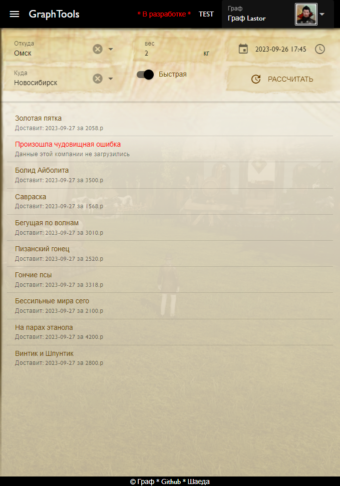

# DeliveryDemo
Test task
## Load repository
```bash
git clone --depth=1 --branch=master https://github.com/symphograph/DeliveryDemo.git .
```

## Install dependencies
```bash
composer install
```
## Create database
Here MySql 8.0.34, but it also works on 5.7

## Config environment
```
copy 
includes/example.env.php 
as 
includes/env.php
and configure it
```
---


Also, you can [see this demo](https://test.aa.dllib.ru/delivery)  with frontend
[](https://test.aa.dllib.ru/delivery)